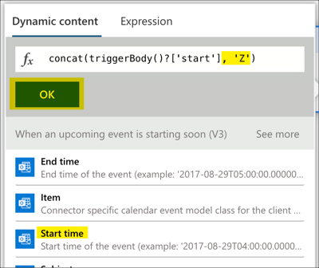

# Control the lights from an Office 365 calendar

The lights can be controlled from your Office365 calendar using an Azure Logic App. You can set the lights to red (`FF0000`) when a meeting starts, then back to green (`00FF00`) when your meeting ends.

## Create the logic app

1. Open the Azure Portal at [portal.azure.com](https://portal.azure.com/?WT.mc_id=busylight-github-jabenn)

1. Log in if you need to using your Microsoft account. If you don't have an Azure account follow the [instructions above](https://github.com/jimbobbennett/BusyLight/tree/master#set-up-the-iot-central-app) to create one.

1. Select **+ Create a resource**

1. Search for `Logic App`, select it then select **Create**

1. Select your Azure subscription

1. For the *Resource group* select **Create new** and name the new resource group **BusyLight**

    > Resource groups are logical groupings of Azure services, allowing you to manage all the services for a particular application or project together.

1. Name the logic app `CalendarControl`

1. Select the *location* closest to you

1. Select **Review + create**, then **Create**

The logic app will be created, and when it is ready select **Go to resource**

## Create a trigger

1. When you first open the Logic App it will take you to the designer. From the *Templates* section, select **Blank logic app**

1. Search the connectors and triggers for `office 365 outlook` and select the **Office 365 Outlook** connector

1. Select the **When an upcoming event is starting soon** trigger

1. The designer will show the new trigger. Select **Sign In** and sign in with your Office 365 account.

1. Select your calendar in the *Calendar Id* drop down

    > If you have multiple calendars to check, you will need to create multiple Logic Apps.

1. Leave the look ahead time at 15 minutes

1. Set an appropriate interval to poll for new items. Depending on how far in advance meetings can added to your calendar you can choose a suitable interval, as you pay for each poll. I use 10 minutes as I don't get meetings appearing in my calendar with less notice than that.

    > This value needs to be less than the look ahead time otherwise events might be missed

### Wait till the event starts

The trigger is fired when it sees an upcoming event, so the app needs to delay till the event actually starts before changing the light to red. Logic app triggers and actions can pass data between them, so the Office 365 connector can pass the start and end times to the next action in the app.

There is a small snag however - date and time formats are hard! The date format passed from the Office connector is not quite right for the one expected by the delay actions, so needs to be adjusted.

1. Select **+ New step**

1. Search for `Schedule` and select **Schedule**

1. Select the **Delay until** action

1. Select the *Timestamp* value and a box should pop up allowing you to build an expression

1. Select the **Expression** tab, then select **Concat**

    

1. Select the **Dynamic content** tab and select **Start time**. If you can't see this, select **See more** from the top of the list.

1. Select the expression, and add `, 'Z'` before the last bracket. The select **OK**.

    

### Execute the IoT Central command to change the light color

The delay will hold till the meeting is about to start, so the next step is to connect to IoT Central to execute the command. To do this, you will need the IoT Central application Id and device Id.

1. Open your IoT Central app

1. Select **Administration** from the left-hand menu

1. Select **Your application** from the *Administration* menu

1. Take a note of the *Application ID*

1. Select **Devices** from the left-hand menu

1. Take a note of the *Device Id* of your device

Once you have this Id, you can create the connector

1. Head back to your logic app

1. Select **+ New step**

1. Search for `Azure IoT Central`, then select **Azure IoT Central**

1. Select the **Run a command** action

1. Once the action appears, select **Sign in** and log in with your Azure account if required

1. Drop down the *Application* box and select **Enter custom value**

1. Enter in the Application ID you noted down earlier

1. Drop down the *Device Template* and select `Busy Light (1.0.0)`

1. Enter your device id in the *Device* box

1. Drop down the *Command* and select `Update Colour`

1. Drop down *Add a new parameter* and check the box next to **Colour**

1. Set the value of *Colour* to be the colour you want when you are in a meeting, using a 6 character RGB hex string. For example, for red enter `FF0000`

## Handle the event ending

Repeat the two steps above to add another Delay Until and Run a Command action to the app. The second delay should use the *End time* instead of the *Start time*, and for the colour use the colour you want when you are not in a meeting, such as `00FF00` for green.

## Save the logic app

1. Select **Save** from the Logic App designer menu to save the Logic App and enable it.

## Test the logic app

Add an upcoming event to your calendar - far enough away that the poll will be run once. Your light will turn red when the event starts and green when it finishes.

In this step you created an Azure Logic app to control the lights from your Office356 calendar. [Check out the other trigger options](./connect-logic-app.md).
